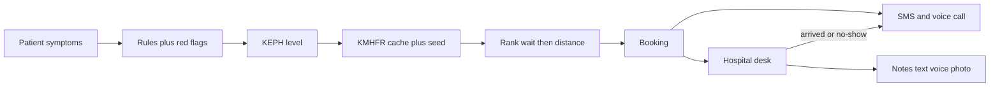

# Kenya hospital pretriage — feature plan and 6-person work split

**Status:** locked for hackathon MVP (Kenya-only).  
**Repo:** `github.com/exabyteso/CareFlow`  
**Journeys:** [user-journeys.md](user-journeys.md)  
**Issues:** [team-issues.md](team-issues.md)  
**Domain/API:** [product-spec.md](product-spec.md)

Agents: attach journeys and the issue that matches your person (P1–P5, T). Do not invent a second facility schema or a diagnosis engine.

## Decisions

- **Done:** demoable MVP with a researched facility registry (identity, KEPH level, lat/lng) so first launch can recommend nearest + shortest wait. Not SHA/AfyaKE and not a medical device.
- **Facility source of truth:** [KMHFR](https://kmhfr.health.go.ke/public/facilities) (~17,357 facilities, Aug 2026, v3.0.1). Live sync + Postgres cache. Do not treat the Esri ArcGIS layer as SoT.
- **Esri-EA layer** ([Health Facilities in Kenya](https://hub.arcgis.com/datasets/Esri-EA::health-facilities-in-kenya/explore?location=-0.170819%2C37.964127%2C8)): optional spatial QA / bootstrap only after field mapping. Not current KEPH.
- **Wait counts:** hospital desk staff enter/update them; ranking is wait then distance. Red flags skip wait ranking and go to the nearest emergency-capable facility (typically KEPH 4+).
- **Geography:** Kenya only — KMHFR, `+254` phones, counties.
- **Languages:** UI/TTS/SMS/calls in English + Kiswahili. Symptom synonyms also for Gĩkũyũ, Dholuo, Kalenjin, Kikamba. Spoken Kikuyu/Luo/Kamba/Meru use **Pawa AI** when ElevenLabs cannot.
- **Triage engine:** rules still pick KEPH. Spoken/typed text maps onto the catalog via our symptom vectors — not an LLM diagnosis.
- **Symptom store:** own catalog + `pgvector` in Postgres. No Pinecone/Weaviate for MVP. No foreign DDx graph as the engine.
- **Voice a11y:** Landing greets and asks to activate voice. Care-seeker booking must work by voice when enabled (J8).
- **Reminders:** Africa’s Talking SMS and **ElevenLabs outbound calls** (Twilio). If ElevenLabs cannot speak the booking locale (Kikuyu/Luo/Kamba/Meru), **Pawa TTS** audio is played on the same Twilio call, or SMS-only if both fail.
- **Voice providers:** **ElevenLabs first** for English/Kiswahili TTS and phone. **[Pawa AI](https://docs.pawa-ai.com/) fallback** wherever ElevenLabs is weak or errors (see Voice routing). Keys stay on the API (`POST /voice/stt`, `POST /voice/tts`).
- **Stack:** Next.js + FastAPI + PostgreSQL + pgvector. SMS: Africa’s Talking. Voice: ElevenLabs + Pawa. Auth: Firebase (federated). FastAPI verifies ID tokens.
- **Primary database (D-001, locked):** PostgreSQL + pgvector is the only product store. ADR: [docs/research/postgresql-primary-store.md](../docs/research/postgresql-primary-store.md). Do not introduce MongoDB, Cassandra, CockroachDB, or Firestore for bookings, facilities, wait counts, notes, or symptom vectors. Firebase is auth only.
- **Client:** one PWA for iteration 1 — `/patient` and `/hospital` (installable, standalone). Not two native apps.
- **Deploy:** local `docker-compose` (API + Postgres with pgvector). Render: Docker Web Service for FastAPI, Render PostgreSQL, second Web Service for Next.js (HTTPS for PWA). Firebase stays on Google.

## Assumptions

- ElevenLabs Swahili TTS is productized; Kikuyu is mainly on **dubbing** lists, not reliable conversational TTS. `[needs validation]` ElevenLabs model ID.
- Pawa STT languages ([docs](https://docs.pawa-ai.com/api-reference/endpoint/voice/speech-to-text)): English, Swahili, Luo, Meru, Kamba, Kikuyu, plus other African langs. Pawa TTS ([docs](https://docs.pawa-ai.com/api-reference/endpoint/voice/text-to-speech)): `pawa-tts-v1-20250704`, voices ame/liora/ayana; docs list Swahili + English first — `[needs validation]` Kikuyu/Luo TTS quality. Pawa has **no outbound telephony**; calls stay ElevenLabs/Twilio with Pawa audio as `<Play>` fallback.
- Browser Web Speech STT for Kiswahili on mobile Chrome is uneven; Pawa STT is the server fallback (not generic Whisper) for Kenyan languages.
- One integration branch (`main`); short-lived feature branches merge into it.
- One Web App Manifest: `start_url` `/`, shortcuts to `/patient` and `/hospital`. `[needs validation]` maskable icons.
- Role and facility live in our DB keyed by `firebase_uid`.
- Voice notes: browser speech → text. Photo notes: upload + vision OCR. `[needs validation]` vision vendor.
- KMHFR API can flake: cache + committed seed. `[needs validation]` public API token path.
- Demo hospital logins seeded against a small set of real KMHFR facilities.
- Secrets: Phantom locally; Render env vars in production. Never commit keys.

## Deferred

SHA / AfyaLink / AfyaKE HIE, live HMIS queues, native apps, production DPA/DPIA, medical-device claims, all 60+ Kenyan languages, separate vector DBs, inbound “call us to book” IVR, Pawa-native telephony, real-time websockets (polling is enough).

## Facility datasources

Hard rule: no live `backend/app/facilities/` sync until [research/big-picture/kenya-pretriage-landscape/deliverables/datasource-scorecard.md](../research/big-picture/kenya-pretriage-landscape/deliverables/datasource-scorecard.md) exists and [research/decision-log.md](../research/decision-log.md) locks the SoT. First boot recommends from cache/seed: `keph_level >= required`, then `wait_count ASC`, distance ASC.

KEPH: 2 dispensary, 3 health centre, 4 primary/county hospital, 5 regional referral, 6 national.

See the research scorecard for KMHFR vs Esri vs HDX vs energydata vs AfyaLink.

## Symptom data + vector store

**Verdict:** our own small Kenya catalog + embeddings in Postgres (`pgvector`). Open ontologies are codes and synonym seeds, not the engine.

- **WHO ICD-11** — best open code system; optional `icd11_uri` on each `symptom_id`.
- **OpenMRS CIEL / KenyaEMR** — Kenya complaint alignment; use a chief-complaint subset.
- **SNOMED CT** — skip as a hard dependency (affiliate license).
- **BODHI-S** — do not use as engine (Indian DDx graph).
- **SympTEMIST** — skip runtime (not Kiswahili).
- **MoH KEPH guidelines** — inform rules (symptom → level), not embeddings.

Flow: ~100–200 canonical symptoms with `keph_min` and red_flag → synonym strings per language → embed → `POST /symptoms/map` → rules pick KEPH. Vectors never pick the hospital level.

## Voice routing (ElevenLabs first, Pawa fallback)

Single backend module `backend/app/voice/` (P3 calls it for in-app; P5 for reminders). Never put vendor keys in the PWA.

| Need | First try | Fallback |
|------|-----------|----------|
| STT English / Kiswahili | ElevenLabs or browser Web Speech | **Pawa** `POST /voice/speech-to-text` (`pawa-stt-v1-20240701`) |
| STT Gĩkũyũ, Dholuo, Kikamba, Kĩmĩĩrũ (Meru) | **Pawa STT** (those langs are in Pawa’s enum; not in ElevenLabs conversational STT) | Kiswahili STT + synonym vectors |
| TTS English / Kiswahili in-app | **ElevenLabs** | **Pawa TTS** `pawa-tts-v1-20250704` |
| TTS Kikuyu / Luo / Kamba / Meru in-app | **Pawa TTS** | ElevenLabs Kiswahili |
| Outbound reminder call en/sw | **ElevenLabs + Twilio** | Pawa TTS MP3 + Twilio play; else SMS only |
| Outbound reminder Kikuyu/Luo/Kamba | Pawa TTS + Twilio play | ElevenLabs call in Kiswahili |

On timeout, 4xx/5xx, or empty transcript: switch provider once, then fail closed to **text UI + SMS** (never block booking).

## Kenya product landscape

No public product does: community symptoms → correct KEPH level → nearest + shortest wait → booking → hospital arrived/no-show → multimodal notes.

Existing (do not duplicate): AfyaKE/AfyaLink, KNH Afya Apex, Smart Triage (Mbagathi/Kiambu), ETAT+, Elgon/Xyvra teleconsult, Synara/Tabibu advice, Amicus WhatsApp, Vezeeta/Ponea/myDawa.

**Wedge:** we sit before the hospital door.

## Product loop

One PWA: `/` (voice consent then role picker), `/patient`, `/hospital`.

## Feature list

**Patient (`/patient`)**

- Firebase sign-in (Google + email/password).
- Enter or speak symptoms (en/sw + synonym languages). Vectors map to catalog; rules pick KEPH.
- Red-flag bypass → nearest KEPH 4+; do not optimise for wait.
- Book right KEPH level, nearest, fewest waiting.
- SMS and phone reminder (ElevenLabs call; Pawa TTS if that language or API is missing).
- Landing: spoken greet + activate voice? (J8).

**Hospital (`/hospital`)**

- Staff sign-in scoped to one facility.
- Set/update people waiting.
- Mark patient as met or did not come.
- Notes: text, voice-to-text, photos of notes/prescriptions.

**Platform**

- Seed + KMHFR sync; Esri QA-only.
- Dockerized FastAPI; Compose; Render; PWA; `/health`.

**Non-goals:** pharmacy e-script networks, SHA claims, ambulance dispatch, AfyaLink clinician-to-clinician referral.

## Architecture

- FastAPI in `backend/` — Dockerfile, compose (api + pgvector Postgres), Alembic, `GET /health`.
- Firebase ID token on protected routes; `users.role` patient | hospital_staff; staff `facility_id`.
- Facilities: Kenya KMHFR only.
- Symptoms: `symptoms` + `symptom_synonyms` + pgvector. `POST /symptoms/map`.
- Bookings: `booked | arrived | no_show | cancelled`. Create increments wait; arrived/no-show decrements.
- Notify: Africa’s Talking + ElevenLabs outbound; Pawa TTS clip if ElevenLabs cannot speak the locale. Demo flags log instead of send/dial.
- Voice: `POST /voice/stt` and `POST /voice/tts` with provider cascade (ElevenLabs → Pawa).
- Notes table: text, audio_transcript, image_urls, ocr_text.
- Next.js PWA, `output: standalone`. Never put Admin key in the browser.

## Six-person split

Each person runs their own Cursor chat as orchestrator. Disjoint paths. Merge into `main`. Attach [user-journeys.md](user-journeys.md). Full issue text: [team-issues.md](team-issues.md).

| Person | Owns | Does not touch |
|--------|------|----------------|
| **P1** | Docker, compose, `backend/app/core/`, `backend/app/auth/`, Alembic, Render, CI | triage, bookings, notes, notify, patient/hospital feature UI |
| **P2** | `backend/app/facilities/`, `backend/app/symptoms/`, later triage + bookings API | Esri as SoT, frontend, notify |
| **P3** | `frontend/app/patient/**`, landing `/` voice consent (J8), Firebase client; calls `/voice/*` | `/hospital/**`, outbound phone calls, vendor keys |
| **P4** | `backend/app/hospital/`, `frontend/app/hospital/**` except `notes/` | triage, SMS, notes OCR |
| **P5** | `backend/app/notes/`, `backend/app/notify/`, `backend/app/voice/` (ElevenLabs + **Pawa fallback**), `frontend/app/hospital/notes/**` | ranking, wait UI, patient landing |
| **T** | `backend/tests/`, `frontend/e2e/`, fixtures, test plan, research expansion | production feature folders |

**Wave 0 / baseline (this repo drop):** plans, journeys, issues, research scorecards, then (follow-on) Docker `/health`, PWA shells, seed recommend stub.

**Wave 1:** P1 auth, P2 KMHFR + pgvector catalog, P3 patient/voice.

**Wave 2:** P2 rules/bookings, P3 book UI, P4 desk, P5 notes/SMS/calls, T tests.

**Wave 3:** Render + E2E (J1–J9).

**Subagent brief:** Owns / Delivers / Does not touch / Journeys (J1–J9) / OpenAPI operation IDs / merge into `main`.

## Pitch-day demo

1. Voice-consent landing → mild symptoms → Level 3/4 nearby with lower wait → book → SMS (or console).
2. Higher wait at the other facility; ranking prefers the quieter one.
3. Red-flag chest pain → nearest Level 4+, wait ignored.
4. Hospital: mark met → photo + voice note.
5. Second patient: did not come → no-show SMS; reminder call logged or demo-dialled.
