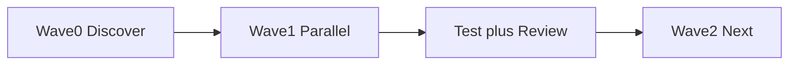

# Feature — subagent orchestration plan

## Goals and constraints

- **Parent** owns merge order, conflict resolution, `echo 'Set TEST_COMMAND in docs/testing-reference.md'`, and moving todos to done
- **Subagents** get bounded prompts: **owns**, **delivers**, **does not touch**
- **Disjoint ownership** — no two agents edit the same file in one wave

## Wave ownership

| Wave | Subagents | Owns (example) | Forbidden |
|------|-----------|----------------|-----------|
| 0 | explore (readonly) | — | writes |
| 1 | A, B parallel | `path/a/**`, `path/b/**` | each other's paths |
| 2 | parent | merge + tests | — |

## Flow

## Acceptance criteria

- [ ] Each wave: disjoint paths documented
- [ ] Parent ran `echo 'Set TEST_COMMAND in docs/testing-reference.md'` between waves
- [ ] Senior review (Ask) before widening E2E scope
- [ ] No stack-specific rules duplicated here — use packs if needed
