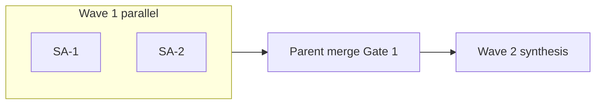

# Orchestration plan — {project-slug}

**Mode:** Plan / Agent — multi-agent research run.

Copy and adapt this skeleton when coordinating parallel subagents. See [`docs/agent-and-subagent-workflow.md`](../../../../docs/agent-and-subagent-workflow.md).

---

## 0. Bootstrap (before Wave 1)

| Action | Owner |
|--------|--------|
| `README.md` stub + deliverable index | Parent |
| `meta/methodology.md`, `meta/sources-log.md` | Parent |
| Archive executed prompt → `meta/research-prompt.md` (use [`research-prompt.header.md`](research-prompt.header.md)) | Parent |
| Write this plan → `meta/orchestration-plan.md` | Parent |
| Add row to tier `INDEX.md` | Parent |

---

## 1. Subagent roster

Each subagent prompt must include **Owns / Delivers / Does not touch** and tag claims `[Verified]` / `[Likely]` / `[Unverified]`.

| ID | Owns (draft paths) | Delivers | Does not touch |
|----|-------------------|----------|----------------|
| **SA-1** | `_drafts/sa-1/` | *(deliverable)* | *(boundaries)* |
| **SA-2** | `_drafts/sa-2/` | *(deliverable)* | *(boundaries)* |

Use `deliverables/_drafts/{id}/` during parallel waves; **parent merges** at gate.



---

## 2. Subagent role prompts (copy-paste for Task tool)

**Shared context (all agents):**

- **Research question:** {one sentence}
- **Evidence:** Tag `[Verified]` / `[Likely]` / `[Unverified]`; append official URLs to `meta/sources-log.md`.
- **Output root:** `deliverables/_drafts/{your-id}/` only — do not edit canonical deliverables or other agents' drafts.
- **Do not** read `research/**/meta/research-prompt*.md`.

**Handback format (all agents):** 1) files written; 2) top 3 recommendations; 3) blockers for parent; 4) open questions.

### Parent orchestrator

```markdown
# Role: Parent orchestrator

## Wave 0
- Create project tree, meta stubs, meta/research-prompt.md (archival), copy meta/orchestration-plan.md.

## Wave 1
- Spawn subagents in parallel with prompts from §2.
- Do not spawn a second agent on the same draft path.

## Gate 1
- Merge _drafts/* into canonical deliverables.
- Consistency pass on shared IDs and terminology.
- Run: `echo 'No automated test suite — validate deliverables manually or add scripts as needed'`
- Senior review in Ask on merged scope; fix blockers before Wave 2.

## Wave 2
- Synthesize integrated report; complete README and success criteria.
```

### SA-1 — {role title}

```markdown
# Role: SA-1 — {role title}

## Owns (write only here)
- `deliverables/_drafts/sa-1/{filename}.md`

## Delivers
- {bullet list}

## Read (deliverables only)
- {prior research paths — summaries via INDEX, not full CSVs}

## Does not touch
- {boundaries}

## Binding constraints
- {constraints from decision-log.md}
```

---

## 3. Deliverable TOC + owners

| File | Primary owner | Wave |
|------|---------------|------|
| README.md | Parent | 0 |
| deliverables/research-report.md | Parent / synthesis | 2 |
| meta/methodology.md | Parent | 0+2 |
| meta/sources-log.md | All (append-only) | 1–2 |

---

## 4. Success criteria (exit)

- {checklist of done conditions}
- [`meta/orchestration-plan.md`](orchestration-plan.md) + [`meta/methodology.md`](methodology.md) complete
- Key decisions mirrored to [`meta/decision-log.md`](decision-log.md) and [`../../decision-log.md`](../../decision-log.md)
